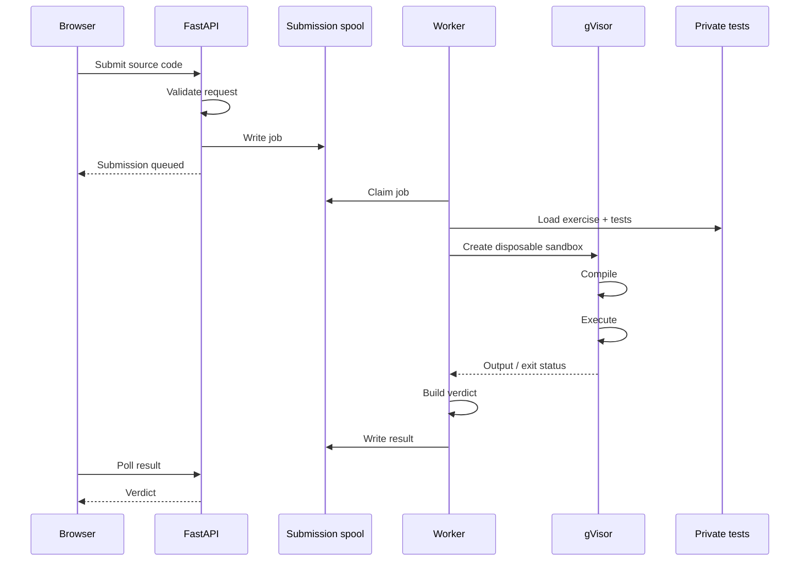
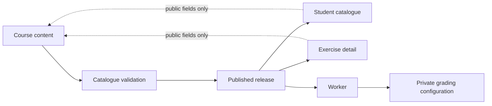
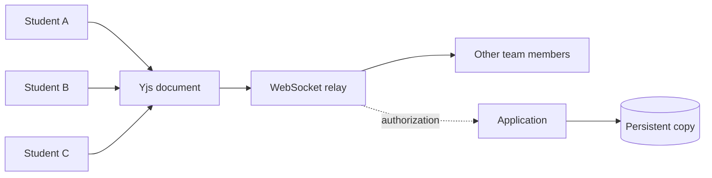

# CTester

**CTester** is a self-hosted C programming platform built for **[TCH009](https://www.etsmtl.ca/etudes/cours/TCH009)** at ÉTS.

Students write C code in the browser, run it in an isolated environment, submit it, and receive immediate feedback from private tests.

## Features

* Browser-based C editor and multi-file workspaces
* Automatic compilation and testing
* Unit tests, stdin/stdout tests, and quizzes
* Private test suites and expected outputs
* Isolated execution of untrusted native code
* Interactive **Console** for running arbitrary C programs
* Draft saving and submission history
* Student progress tracking
* Assistance forum
* Team assignments with live collaboration
* Revision history and ZIP hand-in
* Independently published course content

## Architecture

```text
                           ┌──────────────────────┐
                           │      Student         │
                           │  Browser / Editor    │
                           └──────────┬───────────┘
                                      │
                           HTTP / WebSocket
                                      │
                                      ▼
                    ┌─────────────────────────────────┐
                    │             API                 │
                    │          FastAPI                │
                    │                                 │
                    │  Auth · Catalog · Drafts        │
                    │  Submissions · Progress         │
                    │  Forum · Teams · Console        │
                    └──────────────┬──────────────────┘
                                   │
                            submission spool
                                   │
                                   ▼
                    ┌─────────────────────────────────┐
                    │          Host worker            │
                    │                                 │
                    │  reads submissions              │
                    │  reads private tests            │
                    │  launches sandbox               │
                    └──────────────┬──────────────────┘
                                   │
                              Docker + gVisor
                                   │
                                   ▼
                    ┌─────────────────────────────────┐
                    │        Disposable sandbox       │
                    │                                 │
                    │       C compiler + tests        │
                    └─────────────────────────────────┘
```

### Security boundary

The web application **cannot compile or execute student code** and does not have access to the private grading suite.

```text
┌─────────────────────────────── Web tier ───────────────────────────────┐
│                                                                        │
│  Browser ──► FastAPI ──► spool                                         │
│                 │                                                      │
│                 └── no Docker socket                                   │
│                 └── no private tests                                   │
│                 └── no code execution                                  │
│                                                                        │
└──────────────────────────────────┬─────────────────────────────────────┘
                                   │
                         filesystem / job queue
                                   │
┌─────────────────────────────── Worker host ────────────────────────────┐
│                                   │                                    │
│                         private content                                │
│                                   │                                    │
│                                   ▼                                    │
│                         Docker + gVisor                                │
│                                   │                                    │
│                                   ▼                                    │
│                            student code                                │
│                                                                        │
└────────────────────────────────────────────────────────────────────────┘
```

Each submission gets a fresh sandbox with bounded resources.

## Submission flow



The API never waits for compilation or execution.

## Exercise model

Course content is declarative: an exercise is defined by its content and grading configuration rather than by application code.

```text
Exercise
│
├── metadata
│   ├── id
│   ├── title
│   ├── summary
│   ├── difficulty
│   ├── skills
│   ├── contexts
│   └── prerequisites
│
├── statement
│   ├── Markdown
│   └── or Typst
│
├── release
│   ├── available
│   ├── scheduled
│   └── archived
│
├── files
│   └── student-visible source files
│
└── grading mode
    ├── quiz
    ├── stdin/stdout
    └── Unity unit tests
```

The same catalogue rules are used when publishing content, serving it to students, and loading it for execution.



Private grading configuration is never exposed through the public catalogue.

## Exercise modes

### Quiz

```text
quiz.json
    │
    └──► Questions
          │
          └──► Answer
```

No compilation or sandbox is required.

### stdin/stdout

```text
student program
      │
      ▼
   compile
      │
      ▼
 sandbox
      │
      ▼
 input ──► program ──► stdout
                       │
                       ▼
                 expected output
```

### Unity

```text
Student source
      │
      ├── student functions
      │
      ▼
┌───────────────┐
│ Unity tests   │
└───────┬───────┘
        │
        ▼
   compile + run
        │
        ▼
     verdict
```

## Verdicts

A submission is reduced to a structured verdict rather than exposing the private test suite.

```text
Submission
    │
    ▼
Compilation
    ├── failed ───────────────► Compilation error
    │
    ▼
Execution
    ├── timeout ──────────────► Timeout
    ├── runtime failure ──────► Runtime error
    │
    ▼
Tests
    ├── passed ───────────────► Accepted
    └── failed ───────────────► Wrong answer / test failure
```

The worker also limits compiler output, test output, failed-test details and execution resources.

## Interactive Console

The **Console** is a separate interactive execution path using the same worker infrastructure.

```text
Student
   │
   ▼
Console session
   │
   ▼
submission spool
   │
   ▼
worker
   │
   ▼
interactive sandbox
   │
   ├── stdin  ◄──────── Student
   └── stdout ────────► Student
```

Console sessions are resource-limited and do not use the normal exercise verdict path.

## Team collaboration

Team assignments use **Yjs** for conflict-free collaborative editing.



The server does not interpret the CRDT. It handles authentication, authorization and persistence; Yjs handles document merging.

Teams also provide:

* live cursors
* revision history
* restore
* one team hand-in
* ZIP export

## Content publication

Course content is maintained separately from the application.

```text
Course content repository
          │
          ▼
   content validation
          │
          ▼
      publication
          │
          ▼
   versioned release
          │
          ├────────► Web application
          │
          └────────► Execution worker
```

A release is selected through a `current.json` pointer, making rollback a publication operation rather than an application-state change.

## Frontend

The frontend is a static Svelte application.

```text
                    ┌─────────────────┐
                    │  Git repository │
                    └────────┬────────┘
                             │
                         Vite build
                             │
                             ▼
                    ┌─────────────────┐
                    │  Static bundle  │
                    └────────┬────────┘
                             │
                             ▼
                       GitHub Pages
                             │
                     HTTP / WebSocket
                             │
                             ▼
                          FastAPI
```

There is no frontend server or Node.js process in production.

Authenticated features are split into separately loaded chunks so they are not downloaded by unauthenticated visitors.

## Project structure

```text
app/
  FastAPI application

frontend/
  index.html
  public/
  src/
    components/
      editor / verdict / workbench / action bar
    features/
      student-facing screens
    lib/
      api/
      auth/
      collab/
      domain/
      state/
  tests/

content_catalog.py
  Content validation, discovery and access rules

publish_content.py
  Content publication and release management

runner.py
  Host-side execution worker

import_teams.py
  Team roster import / corrections

build-unity.sh
  Unity unit-test execution

build-io.sh
  stdin/stdout execution

test_*.py
  Backend and integration tests

```

Course tests and reference solutions are stored separately from the public application.

## Tech stack

| Layer            | Technology                    |
| ---------------- | ----------------------------- |
| Backend          | Python 3.13, FastAPI, Uvicorn |
| Frontend         | Svelte 5, TypeScript, Vite    |
| Database         | PostgreSQL                    |
| Execution        | Docker + gVisor               |
| Collaboration    | Yjs + WebSocket               |
| Deployment       | Ansible                       |
| Frontend hosting | Static bundle / GitHub Pages  |

## Development

### Backend

```sh
pip install -r requirements-dev.txt
```

### Frontend

```sh
npm ci

npm run dev
npm run build
npm run check
npm test
```

### Local application

```sh
CTESTER_KEY=dev \
CTESTER_PUBLISHED=/tmp/published \
CTESTER_PAGE=frontend/dist \
python3 app/main.py
```

### Tests

```sh
python3 test_ctester.py
python3 test_api.py
```

The test suite covers the application, content catalogue, frontend and PostgreSQL integration.

## Design principles

```text
Private by default
      │
      ▼
Explicit publication
      │
      ▼
Independent execution
      │
      ▼
Isolated untrusted code
      │
      ▼
Structured feedback
```

CTester deliberately keeps the web tier, course content and code execution separate:

```text
Application
    ≠
Course content
    ≠
Grading environment
```

That separation is the core of the system.

---

Built for teaching C at **[École de technologie supérieure (ÉTS)](https://www.etsmtl.ca/)**.
