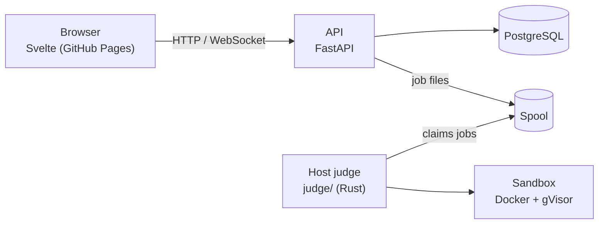

# CTester

A self-hosted C programming platform built for **[TCH009](https://www.etsmtl.ca/etudes/cours/TCH009)** at ÉTS.
Students write C in the browser and get immediate feedback from private tests, run in an isolated sandbox.

## Features

- Browser C editor with multi-file exercises, syntax hints and IDE shortcuts
- Three grading modes: quizzes, stdin/stdout programs, Unity unit tests
- An interactive **Console** to run any C program and type into it
- Drafts, progress tracking, skills and achievements
- A moderated help forum and chat, optionally bridged to Discord
- Team assignments with live collaborative editing, revision history and ZIP hand-in
- Course content published independently of the application, with scheduled releases

## Architecture



The API never compiles or runs code and cannot read the tests. It writes a job to the spool and
returns immediately. A worker on the host claims the job, judges it in a disposable container with no
network, and writes the verdict back for the browser to poll.

Course content lives in a separate private repository. `worker/publish_content.py` validates it and writes a
versioned public projection. `current.json` points at the active release, so a rollback is a pointer
change.

## Repository layout

```text
app/                          FastAPI application (routers = HTTP, services = logic, state.py = SQL)
frontend/                     Svelte 5 + TypeScript page, built with Vite
judge/                        host judge (Rust): queue, sandbox, verdicts, verdict cache, console sessions
worker/
  judge.py                    the judge's grading rules, for the content tools
  content_catalog.py          content validation and access rules
  publish_content.py          release publication and rollback
  typst_build.py              Typst statement rendering
  build-*.sh                  what runs inside the sandbox for each mode
scripts/
  validate_content.py         content validation
  verify_content.py           reference solutions against their tests
  render_statement.py         local Typst preview
  import_teams.py             team roster corrections
  load_test.py                load testing
deploy/                       Compose stack, systemd units, update scripts, env.example
tests/                        backend, sandbox and PostgreSQL checks
bot/bridge.py                 Discord bridge
typst/                        statement template and vendored Typst packages
docs/                         operations runbook and the Typst authoring guide
```

## Development

```sh
pip install -r requirements-dev.txt
npm ci

npm run check && npm run build && npm test
python3 tests/test_ctester.py
python3 tests/test_api.py
```

Run the page and API locally against published content:

```sh
python3 worker/publish_content.py ../unittests/content /tmp/published
CTESTER_KEY=dev CTESTER_PUBLISHED=/tmp/published CTESTER_PAGE=frontend/dist python3 app/main.py
```

Real verdicts also need a worker, which requires Docker and gVisor. See
[docs/operations.md](docs/operations.md) for the full list of checks, deployment and troubleshooting.

## Tech stack

| Layer         | Technology                     |
| ------------- | ------------------------------ |
| Backend       | Python 3.13, FastAPI, Uvicorn  |
| Frontend      | Svelte 5, TypeScript, Vite     |
| Database      | PostgreSQL                     |
| Execution     | Rust judge, Docker + gVisor    |
| Collaboration | Yjs over WebSocket             |
| Deployment    | Compose, systemd, GitHub Pages |
